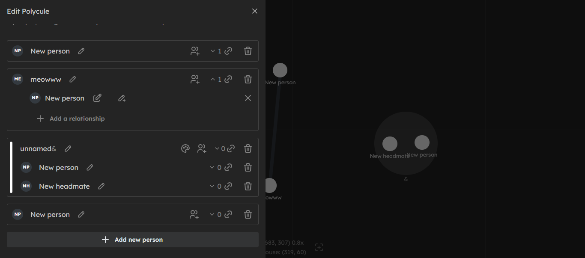

# poly.deniz.blue

Graph editor for non-monogamous relationships of any kinds.

WORK IN PROGRESS

TODO:
- [ ] Dragging people around
- [ ] Relationship customization
- [ ] PluralKit importing
- [ ] Graph Merging

## Development

Use pnpm!

Run `pnpm dev` to develop the frontend.

Run `pnpm bdev` to develop the backend.

## Old Version

[Permalink](https://github.com/deniz-blue/polycules/tree/5befe51973fd09860521bef04bdf32576aea8664)
